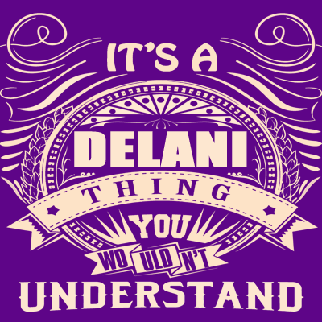

Delani-Studio
Author
Molly-Mumbi

Description
This project is a web application for Delani studio that shows details about the services it offers, has information about the studio, a portfolio section and a form that enables users to send their messages and concern to Delani studios.

Screenshot

Live Page
https://github.com/Molly-code-dev/Delani-Studio

Installation / Setup instruction
Open Terminal {Ctrl+Alt+T}

git clone https://github.com/Molly-code-dev/Delani-Studio.git

cd Delani-Studio

code . or atom . depending on the text editor of your choise.

Technologies Used
HTML5
CSS
Bootstrap
jQuery
markdown
BDD
Behaviour	Input	Output
Enter your name	Molly Mumbi	
Enter your Email Address	mollymumbi42@gmail.com	
Enter your message or comment	I would love to work with you	
Press Submit		Pop up "Molly Mumbi , we have received your message. Thank you for reaching out to us.
Known Bugs
The site is not responsive enough for some devices.
mail chimp API does not function properly.
Contact Information
If you have any question or contributions, please email me at [mollymumbi42@gmail.com]

License
MIT License:
Copyright (c) 2020 Molly Mumbi
